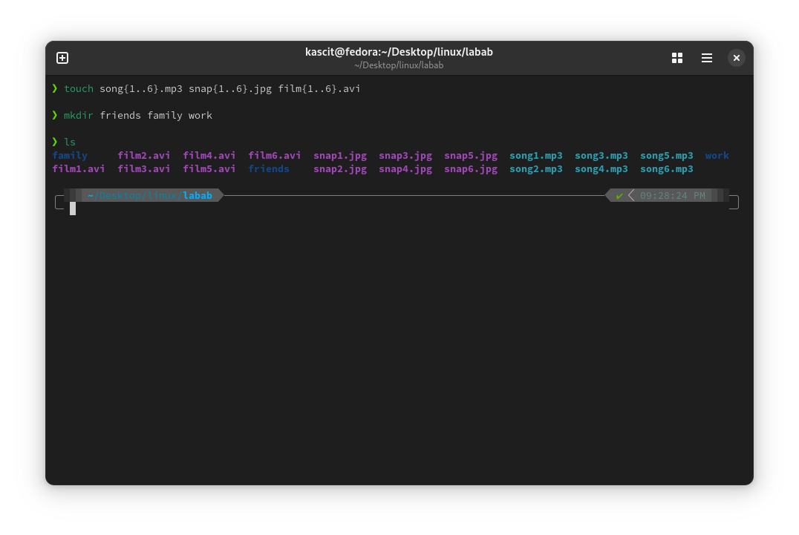

# Lab 1: File Creation and Directory Management  

## 📌 Objective  
Learn how to create multiple files and directories using the `touch` and `mkdir` commands efficiently.  

## 🛠️ Steps  

### 1️⃣ **Create Multiple Files Using `touch`**  
Run the following command to create six `.mp3`, `.jpg`, and `.avi` files:  

````bash
touch song{1..6}.mp3 snap{1..6}.jpg film{1..6}.avi
````

### 2️⃣ **Create Multiple Directories**  
Run the following command to create `friends`, `family`, and `work` directories:  

````bash
mkdir friends family work
````

## 🖼️ **Screenshot**  

