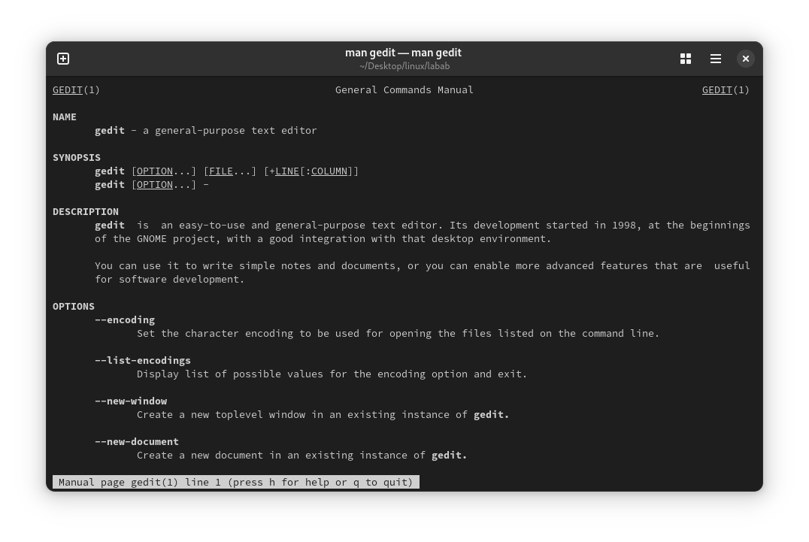
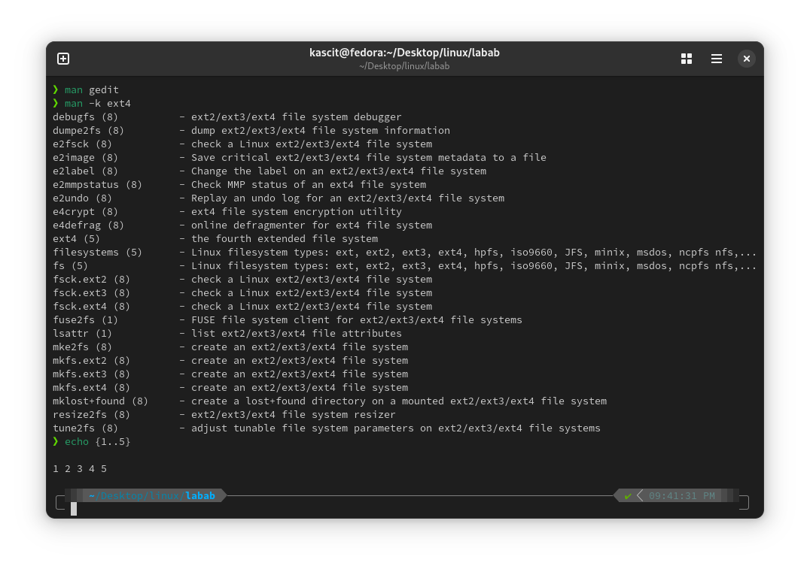

# Lab 2: Exploring Man Pages and Brace Expansion

## 📌 Objective
Learn how to use man pages, search commands related to `ext4`, and apply brace expansion in Linux.

## 🛠️ Steps

### 1️⃣ **View the `gedit` Man Page**
Run the following command to access the manual page for `gedit`:

```bash
man gedit
```

### 2️⃣ **Search for Commands Related to `ext4`**
Use the `man -k` command to find commands related to `ext4`:

```bash
man -k ext4
```

### 3️⃣ **Using Brace Expansion**
Brace expansion generates strings based on a pattern. Run the following examples:

```bash
echo file{A,B,C}.txt
```
**Output:** `fileA.txt fileB.txt fileC.txt`

```bash
echo {1..5}
```
**Output:** `1 2 3 4 5`

## 🖼️ **Screenshots**



