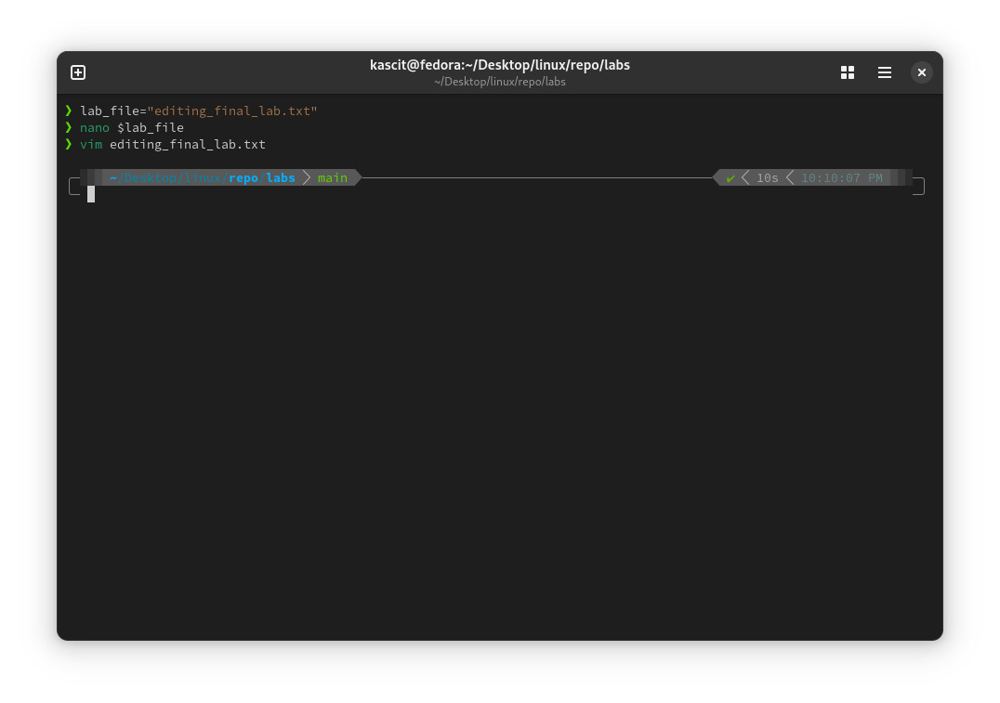
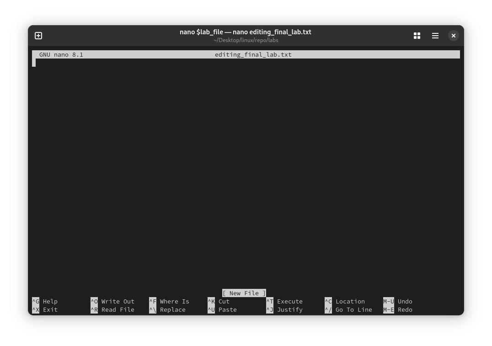
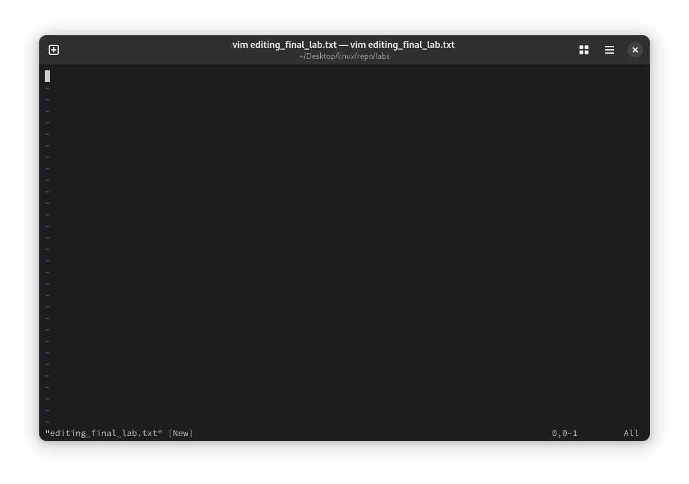

# Lab 3: Editing Files with Vim and Nano

<div align="right">
    ⬅️<a href="../README.md"> Back</a>
</div>

## 📌 Objective
Learn how to use `vim` and `nano` to edit files, utilize shell variables, and modify text efficiently.

## 🛠️ Steps

### 1️⃣ **Create and Open the File in Nano or Vim**
```bash
nano editing_final_lab.txt
```
or
```bash
vim editing_final_lab.txt
```

### 2️⃣ **Use a Shell Variable to Store the File Name**
```bash
lab_file="editing_final_lab.txt"
nano $lab_file# Opens the file in nano
vim $lab_file # Opens the file in Vim
```

### 3️⃣ **Enter Visual Mode in Vim**
- Open the file in Vim:
```bash
vim editing_final_lab.txt
```
- Press `v` to enter **Visual Mode**.
- Use arrow keys to select text.
- Press `d` to delete selected text.

### 4️⃣ **Remove the Last Seven Characters from the First Column on the First Line**
- In Vim, move the cursor to the start of the first line.
- Press `^` to jump to the beginning of the line.
- Type:
```
07x
```
(This removes 7 characters from the start of the line.)

### 5️⃣ **Preserve Only the First Four Characters of the First Column**
- Move to the start of the first line.
- Type:
```
5ld
```
(This deletes everything after the first 4 characters.)

## 🖼️ **Screenshots**
 

 



<div align="right">
    ⬅️<a href="../README.md"> Back</a>
</div>
