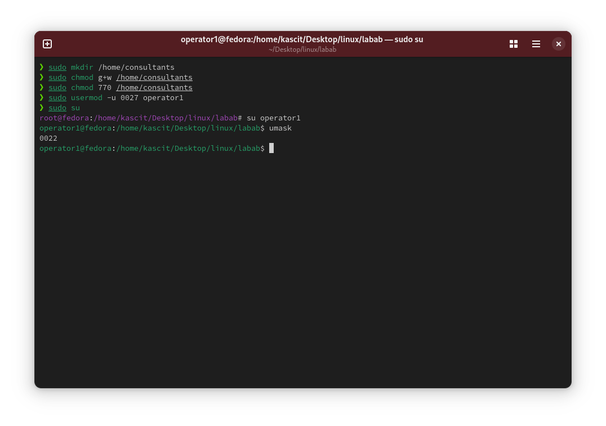

# Lab 4: Directory Permissions and User Access Control
<div align="right">
    ⬅️<a href="../README.md"> Back</a>
</div>
## 📌 Objective
Learn how to create directories, set permissions using symbolic and octal methods, and configure `umask` for user access control.

## 🛠️ Steps

### 1️⃣ **Create the `/home/consultants` Directory**
Run the following command to create the directory:

```bash
sudo mkdir /home/consultants
```

### 2️⃣ **Add Write Permission to the `consultants` Group**
Use symbolic notation to grant group write access:

```bash
sudo chmod g+w /home/consultants
```

### 3️⃣ **Restrict Access for Others**
Use the octal method to set strict permissions (no access for others):

```bash
sudo chmod 770 /home/consultants
```

### 4️⃣ **Change the Default `umask` for `operator1`**
Edit the user's shell profile to set a restrictive `umask`:

```bash
sudo usermod -u 0027 operator1
```

Verify the change by switching to `operator1` and checking the `umask`:

```bash
su - operator1
umask
```

## 🖼️ **Screenshot**

<div align="right">
    ⬅️<a href="../README.md"> Back</a>
</div>
