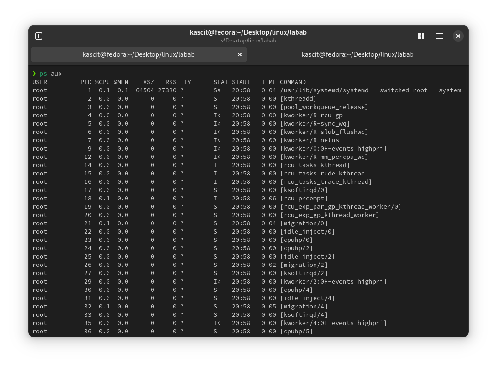
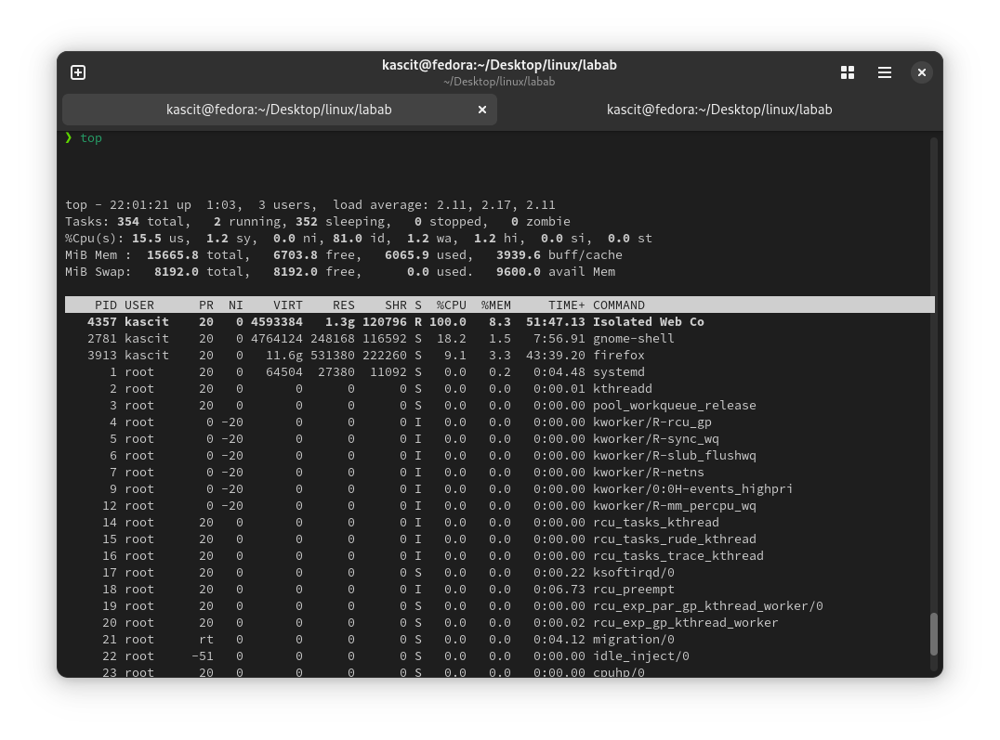
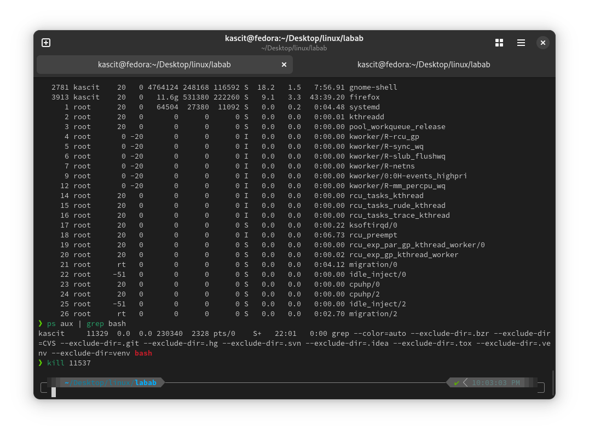
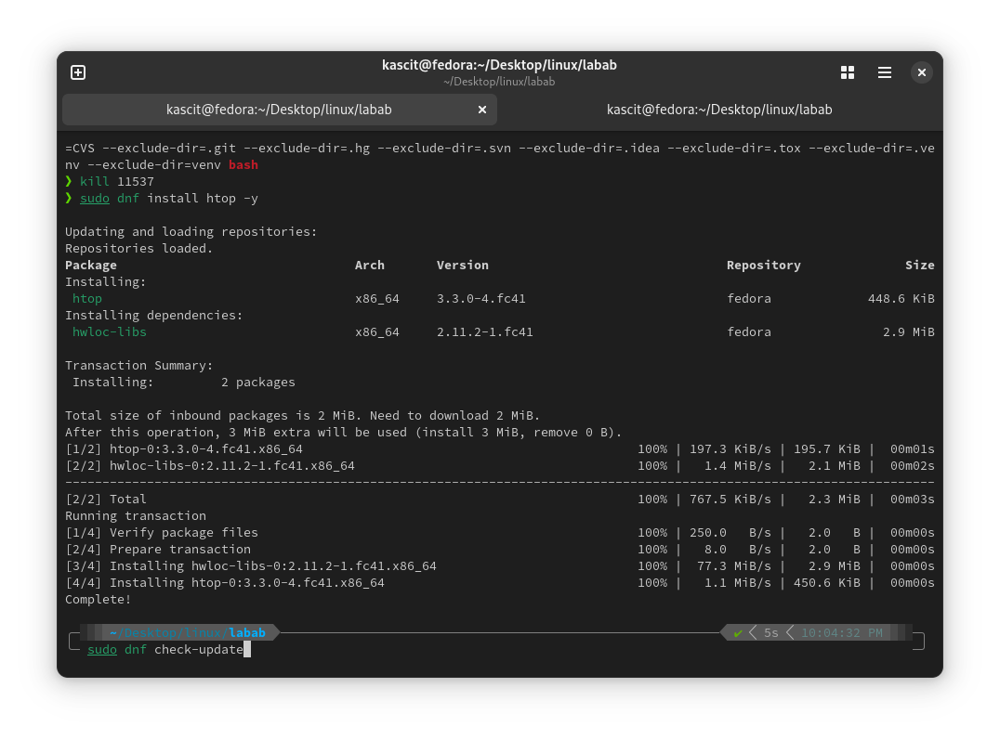
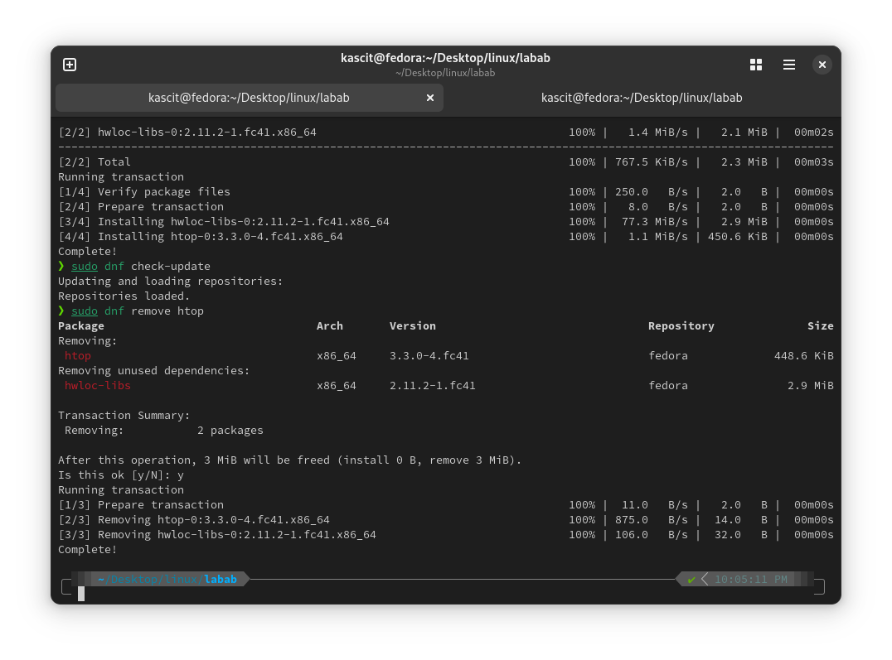

# Lab 5: Process Management and Package Management

## 📌 Objective
Learn how to manage system processes using `ps`, `top`, and `kill` commands and handle software installation using `dnf`.

## 🛠️ Steps

### 1️⃣ **View Running Processes**
Use the following commands to list active processes:

```bash
ps aux# Display all running processes
top # Interactive real-time process viewer
```

### 2️⃣ **Kill a Process**
Find the process ID (PID) and terminate it:

```bash
ps aux | grep process_name # Find PID of a process
kill <PID># Kill process by PID
kill -9 <PID> # Force kill a process
```

### 3️⃣ **Manage Software Using `dnf`**
#### 🔹 Install a package:
```bash
sudo dnf install package_name
```
#### 🔹 Update package lists:
```bash
sudo dnf check-update
```
#### 🔹 Remove a package:
```bash
sudo dnf remove package_name
```

## 🖼️ **Screenshots**





