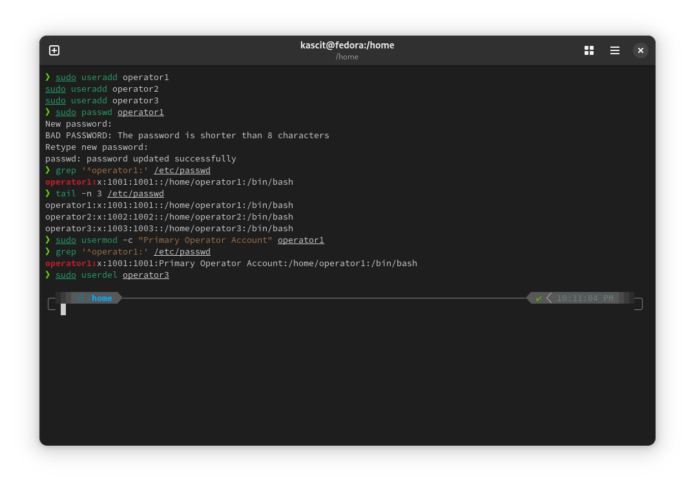

# Lab 6: User Management in Linux  

## 📌 Objective  
Learn how to create, manage, and remove users in Linux using `useradd`, `passwd`, `usermod`, and `userdel` commands.  

## 🛠️ Steps  

### 1️⃣ **Create Users**  
Run the following commands to create users:  

```bash
sudo useradd operator1
sudo useradd operator2
sudo useradd operator3
```

### 2️⃣ **Set Passwords for Users**  
Assign passwords to each user:  

```bash
sudo passwd operator1
sudo passwd operator2
sudo passwd operator3
```

### 3️⃣ **Verify That a User Exists**  
Check if `operator1` exists using `/etc/passwd`:  

```bash
grep '^operator1:' /etc/passwd
```

Alternatively, check the last few added users:  

```bash
tail -n 10 /etc/passwd
```

### 4️⃣ **Update User Information**  
Modify the comment field for `operator1`:  

```bash
sudo usermod -c "Primary Operator Account" operator1
```

### 5️⃣ **Remove a User**  
Delete `operator3` from the system:  

```bash
sudo userdel operator3
```

## 🖼️ **Screenshot**  

