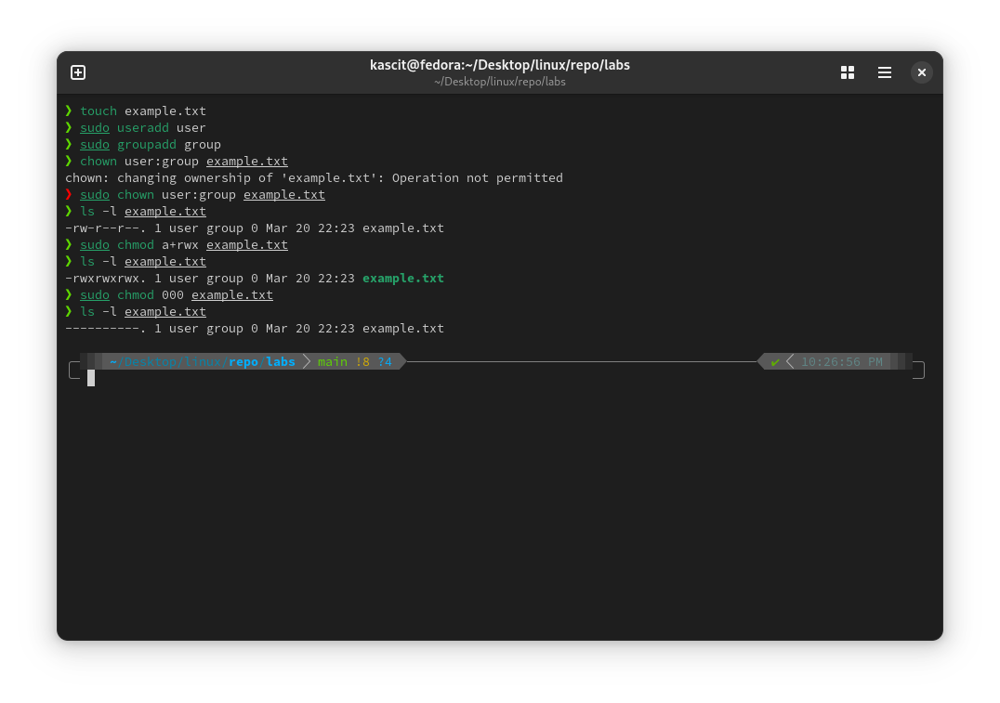

# Lab 7: Implementing `chown` and `chmod` Commands

<div align="right">
    ⬅️<a href="../README.md"> Back</a>
</div>

## 📌 Objective
Learn how to change file ownership using `chown` and modify file permissions using `chmod` with different options.

## 🛠️ Steps

### 1️⃣ **Change File Ownership (`chown`)**
Change the owner of `example.txt` to `user1`:
```bash
chown user1 example.txt
```

Change both owner and group:
```bash
chown user1:group1 example.txt
```

Change ownership of a directory and all its contents:
```bash
chown -R user1:group1 /path/to/directory
```

### 2️⃣ **Modify File Permissions (`chmod`)**

#### **Using Symbolic Mode:**
Grant execute (`+x`) permission to the owner:
```bash
chmod u+x example.txt
```

Remove write (`-w`) permission from others:
```bash
chmod o-w example.txt
```

Grant read (`r`), write (`w`), and execute (`x`) permissions to all (`u`, `g`, and `o`):
```bash
chmod ugo+rwx example.txt
```

#### **Using Octal Mode:**
Set file permissions to **read (4), write (2), execute (1)**:
```bash
chmod 755 example.txt
```
(Owner: `rwx`, Group: `r-x`, Others: `r-x`)

Make a file **read and write** for owner only:
```bash
chmod 600 example.txt
```

## 🖼️ **Screenshot**


<div align="right">
    ⬅️<a href="../README.md"> Back</a>
</div>
