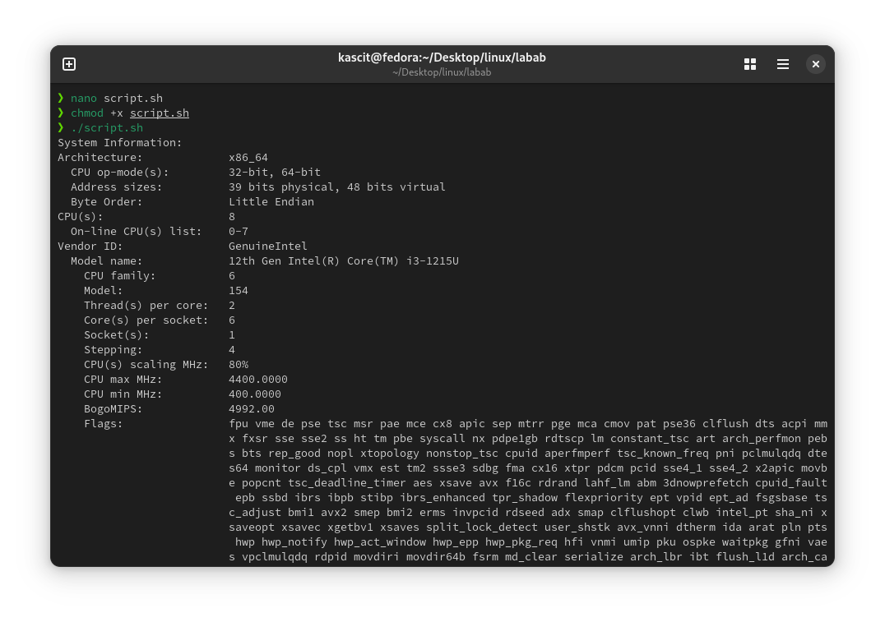
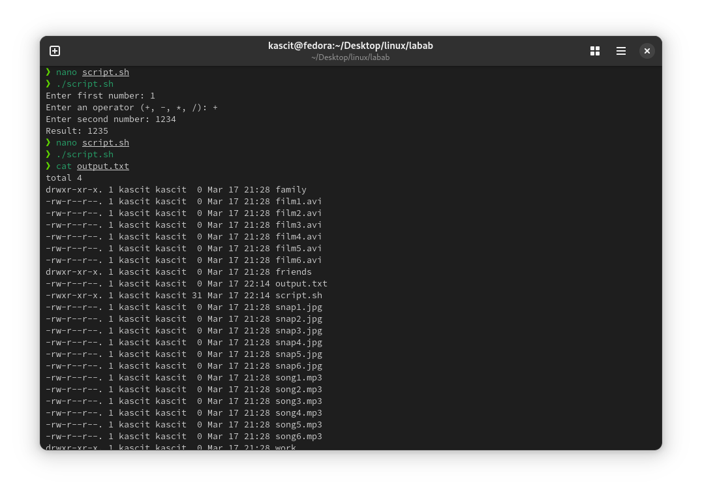

# Lab 8: Shell Scripting Basics

<div align="right">
    ⬅️<a href="../README.md"> Back</a>
</div>

## 📌 Objective
Write shell scripts to print system information, perform basic mathematical calculations with user input, and use redirection operators.

## 🛠️ Steps

### 1️⃣ **Print System Information**
Run the following shell script to display system details:

```bash
#!/bin/bash
echo "System Information:"
lscpu
```

### 2️⃣ **Perform Basic Mathematical Calculation with User Input**
Use the following script to take two numbers as input and perform an operation:

```bash
#!/bin/bash
read -p "Enter first number: " num1
read -p "Enter an operator (+, -, *, /): " op
read -p "Enter second number: " num2
echo "Result: $((num1 $op num2))"
```

### 3️⃣ **Use Redirection Operators**
Store command output in a file using redirection:

```bash
ls -l > output.txt
```

## 🖼️ **Screenshots**




<div align="right">
    ⬅️<a href="../README.md"> Back</a>
</div>
